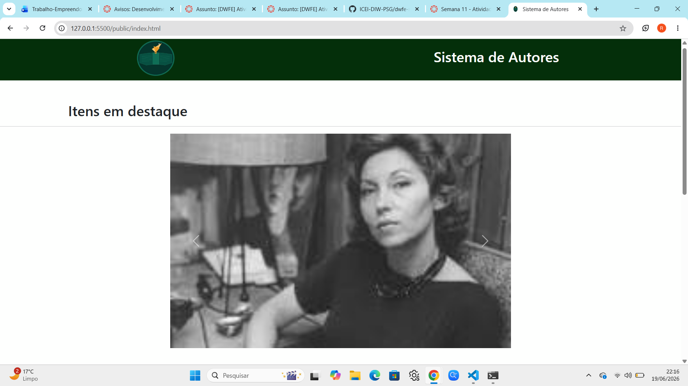
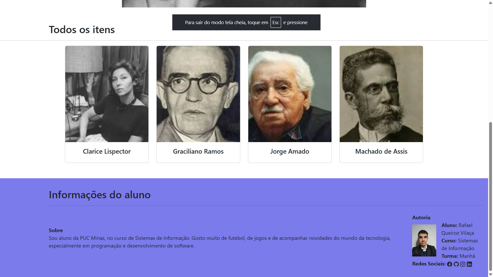
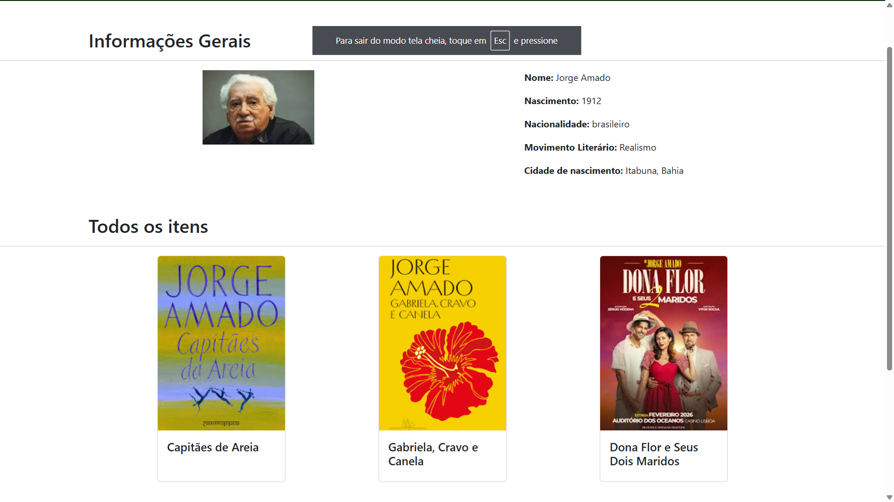

# Trabalho Prático - Semana 11

Nesta atividade, vamos evoluir o projeto em que estamos trabalhando nesse semestre, acrescentando a página de detalhes.

Imagine que a página principal (home-page) mostre um visão dos vários itens que existem no seu site. Ao clicar em um item, você é direcionado pra a página de detalhes. A página de detalhe vai mostrar todas as informações sobre o item do seu projeto, seja esse item uma notícia, filme, receita, lugar turístico ou evento.

## Informações Gerais

- Nome: Rafael Queiroz Vilaça
- Matricula: 928776
- Decreva brevemente seu projeto:
- O Sistema de Gestão de Autores e Livros é uma aplicação web desenvolvida para organizar e gerenciar informações sobre autores e suas obras literárias. O sistema permite cadastrar, visualizar e pesquisar autores e livros, facilitando o acesso a dados como nome, categoria e publicações mais recentes.

A interface foi pensada para ser simples e intuitiva, oferecendo campos de busca e filtros que ajudam o usuário a encontrar rapidamente as informações desejadas. Além disso, o sistema pode ser utilizado como base para projetos maiores, podendo futuramente incluir funcionalidades como edição, exclusão de registros e integração com banco de dados.

## Prints do trabalho

<< COLOQUE A IMAGEM - HOME-PAGE - AQUI >>



<< COLOQUE A IMAGEM - TELA DE DETALHES - AQUI >>


## Dados em JSON

Inclua aqui a estrutura de dados definida por você para o projeto com pelo menos dois exemplo de dados.

```json

{
  "autores": [
    {
        "id": 1,
        "nome": "Clarice Lispector",
        "anoNascimento": 1920,
        "imagem": "../public/img/clarice-lispector.jpg",
        "nacionalidade": "brasileiro",
        "movimentoLiterario": "Realismo",
        "cidadeNascimento": "Chechelnyk, Ucrânia",
        "livros": [
            {
                "id": 1,
                "titulo": "A Hora da Estrela",
                "imagem": "../public/img/a-hora-da-estrela.jpg"
            },
            {
                "id": 2,
                "titulo": "Perto do Coração Selvagem",
                "imagem": "../public/img/perto-do-coracao-selvagem.jpg"
            },
            {
                "id": 3,
                "titulo": "Laços de Família",
                "imagem": "../public/img/lacos-de-familia.jpg"
            }
        ],
        "destaque": true
    },
    {
        "id": 2,
        "nome": "Graciliano Ramos",
        "anoNascimento": 1892,
        "imagem": "../public/img/graciliano-ramos.jpg",
        "nacionalidade": "brasileiro",
        "movimentoLiterario": "Realismo",
        "cidadeNascimento": "Quebrangulo, Alagoas",
        "livros": [
            {
                "id": 1,
                "titulo": "Vidas Secas",
                "imagem": "../public/img/vidas-secas.jpg"
            },
            {
                "id": 2,
                "titulo": "São Bernardo",
                "imagem": "../public/img/sao-bernardo.jpg"
            },
            {
                "id": 3,
                "titulo": "Memórias do Cárcere",
                "imagem": "../public/img/memorias-do-carcere.jpg"
            }
        ],
        "destaque": true
    },
  ]
}
```
